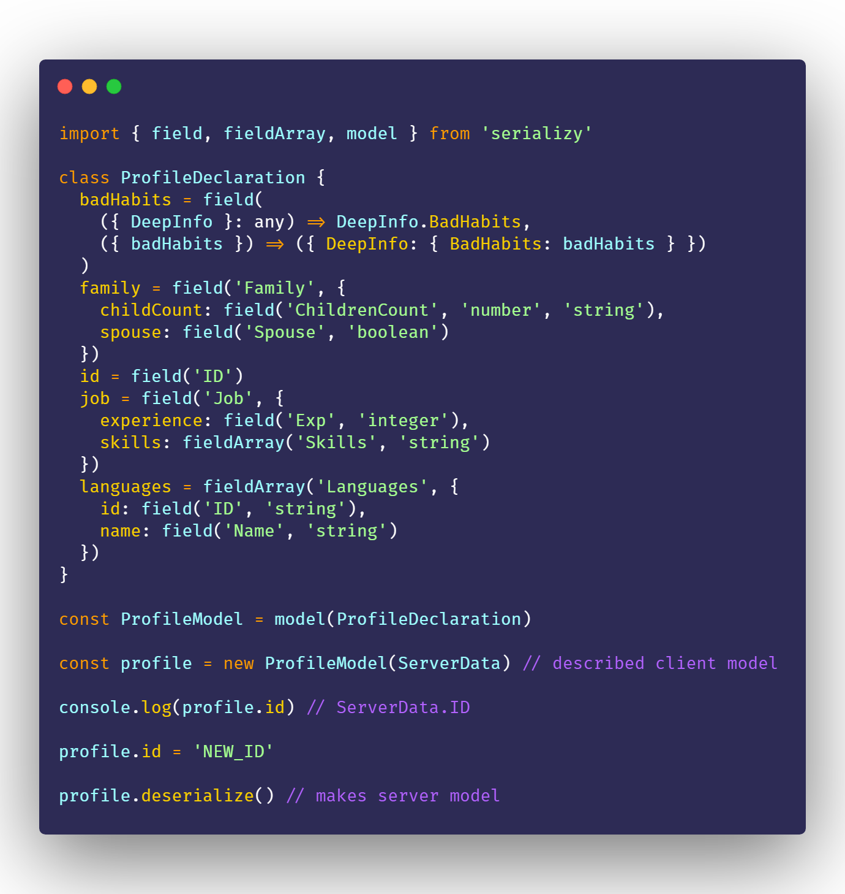
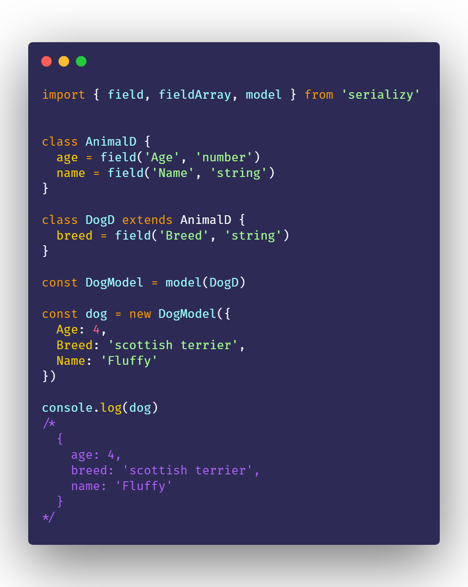

<div align="center">

  [](https://www.npmjs.com/package/serializy) 

  [](./LICENSE)
  [](https://www.npmjs.com/package/serializy)
  [](https://travis-ci.org/acacode/serializy)
  [](http://npm-stat.com/charts.html?package=serializy)
  [](https://bundlephobia.com/result?p=serializy)
  [](https://bundlephobia.com/result?p=serializy)

  <p>
    Data mapper between client-side and server-side applications
  </p>
</div>

## ❓ What is that ?

This thing allows you to don't have to worry about changing server-side structures!  
  
Sometimes when server change JSON structures or frontend start using different API  
These situations can make some problems in frontend applications  
Because mostly use the same structure from server when develop the user interfaces  
  
But with **serializy** you can describe structure which you will use and which server wants to see  

Sounds interesting, yeah ? :-)  
Scroll down and take a look at the examples ;-)


## 💡 How to use

Nothing to hard, just create class or simple object which will contain all your model declarations (using `field()`, `fieldArray()`).  
And send this class/object to the `model()` function as argument  
Like in example:  

```js
import { field, model } from 'serializy'

class CoffeeDeclaration {
  isDrink = field('IS_THAT_DRINK', 'boolean')
}

const YourCoffeeModel = model(CoffeeDeclaration)
```

And when you get server model just create instance of your declared model:  

```js

const ServerModel = {
  IS_THAT_DRINK: true
}

const coffee = new YourCoffeeModel(ServerModel)

console.log(coffee.isDrink) // will be true :-)
```

But what if you need to change your client model and send it to the server ?  
You can use `.deserialize()` of each created instance of declared model:  
```js

coffee.isDrink = false

coffee.deserialize()
/*
{
  IS_THAT_DRINK: false
}
*/
```
Also your created model declaration (like `YourCoffeeModel`) have methods:  
- `.serialize(serverModel)` - to convert server-side model to client-side  
- `.deserialize(clientModel)` - to convert client-side model to server-side  
  
## 📚 Documentation
Serializy have exports: `field()`, `fieldArray()`, `model()`  

<hr>

### `field()`[[Source]](./src/field_declaration.ts#L33)  

This function is needed for describing property of server-side structure.  
  

Argument variations:  
- `field(originalPropertyName: string, originalType?: string, usageType?: string)`  

`originalType` and `usageType` should be one of the [following strings](./src/converter.ts#L14)('boolean', 'float', 'integer', 'number', 'string'):  
  


  
- `field(originalPropertyName: string, modelDeclaration: ModelDeclaration)`  

[`modelDeclaration`](./src/field_declaration.ts#L8) should be `object`/`model(DeclarationsClass)`  
And keys/properties should have values created via `field()`, `fieldArray()` function  
  
  


- `field(customSerializer: function, customDeserializer: function)`  

You can attach custom serializer/deserializer for specific cases.  
  
<!-- Function `field()` needs you to describe some property of your model like  
```
class  -->

### `fieldArray()`[[Source]](./src/field_declaration.ts#L38)  

This is the same thing like [`field()`](#fieldsource) but it needs to describe array of data  


Argument variations:  

- `fieldArray(originalPropertyName: string, originalType: string)`  
`originalPropertyName` - name of property which should be exist in original structure  
`originalType` should be one of the [following strings](./src/converter.ts#L14)('boolean', 'float', 'integer', 'number', 'string')  


- `fieldArray(originalPropertyName: string, modelDeclaration: ModelDeclaration)`  
`originalPropertyName` - name of property which should be exist in original structure  
[`modelDeclaration`](./src/field_declaration.ts#L8) should be `object`/`model(DeclarationsClass)`  
And keys/properties should have values created via `field()`, `fieldArray()` function  

<hr>


## Examples  




## 📝 License

Licensed under the [MIT License](./LICENSE).
